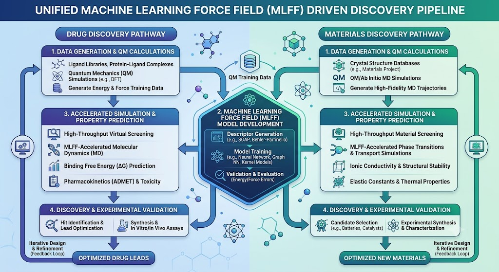

# Foundation Machine Learning for Chemistry and Drug Discovery at Scale

Repository for MLOps pipeline for training, deploying, and monitoring MLFFs for chemistry and drug discovery.

*The terms Machine Learning Force Field (MLFF) and Machine Learning Interatomic Potential (MLIP) are used interchangeably.*



## MLFF for (Quantum) Chemistry and Drug Discovery

Foundation models such as **UMA** (Universal Models for Atoms) and **MACE** (Message Passing Atomic Cluster Expansion) use massive pre-training datasets to capture complex, multi-body interactions and physical symmetries of molecules. In drug discovery, these pre-trained potentials allow for rapid, high-fidelity geometry optimizations, conformer searches, and molecular dynamics simulations of drug-target complexes without requiring system-specific retraining.

## 🚀 MLOps Framework & Resources

Hands-on guide for training, deploying, and monitoring MLFF model that scales automatically.

### 📖 [MLOps Comprehensive Guide](mlops/README.md)

The guide covers

1. **Lifecycles** - Active learning loop and data verification.
2. **Scaling** - Distributed training architectures for HPC (SLURM) and AWS Cloud (SageMaker, FSx for Lustre).
3. **Serving** - High-throughput FastAPI and Triton Inference Server wrapping.
4. **Monitoring** - Real-time out-of-distribution (OOD) geometry & bond-clash detection.

### 🛠️ MLOps Core Scripts

Our pipeline consists of the following components under the [mlops/](mlops) folder

* **[dataset_prep.py](mlops/dataset_prep.py)**: Converts `.xyz`/`.extxyz` coordinates into PyTorch Geometric graph datasets based on distance cutoffs.
* **[train_pipeline.py](mlops/train_pipeline.py)**: Distributed DDP training script in PyTorch that computes energies and derives forces analytically using double autograd. Logs metrics to MLflow.
* **[inference_service.py](mlops/inference_service.py)**: FastAPI microservice exposing `/predict` (energies and forces) and `/optimize` (structure relaxation integrating an ASE LBFGS optimizer).
* **[monitor_drift.py](mlops/monitor_drift.py)**: Detects atomic bond clashes and checks geometric drift using pairwise distance distributions to alert on OOD structures.

### 🏢 Orchestration & Infrastructure Templates

* **[submit_hpc.sh](mlops/submit_hpc.sh)**: A SLURM submit template for multi-node, multi-GPU training clusters via `torchrun`.
* **[run_sagemaker.py](mlops/run_sagemaker.py)**: AWS SageMaker SDK launcher targeting large multi-GPU instances (e.g. `ml.p4d.24xlarge`) utilizing FSx for Lustre.

## 🤖 Agent skills

Specialized agent skills have been integrated under the `.agents/skills/` directory to guide AI (like Claude and Gemini) through computational chemistry and ML interatomic potential development tasks.

### 📋 Skill Agents Registry

| Skill / Component | Agent Name | Action / Purpose |
| :--- | :--- | :--- |
| **Molecular Graph & Scaffold Splitting** | `ScaffoldSplitAgent` | Prevents chemical space data leakage between train/val/test splits. |
| **Multi-Task Learning with ACS** | `MultitaskACSAgent` | Mitigates negative transfer by checkpointing task-specific states independently. |
| **Differentiable Information Imbalance** | `DIIFeatureSelector` | Selects relevant molecular feature subsets via gradient descent. |
| **Deep Ensembles UQ** | `EnsembleUQAgent` | Partitions total predictive uncertainty into aleatoric and epistemic components. |
| **Activity Cliff Awareness** | `ActivityCliffAgent` | Adjusts representation coordinates around cliff compounds using TSM loss. |
| **Delta-ML & Transfer Learning** | `DeltaTransferMLAgent` | Achieves chemical accuracy with small high-fidelity data via pre-training/fine-tuning. |
| **Conformation Generation & DFT Input** | `ConformationDFTAgent` | Prepares optimized conformer coordinates and inputs for DFT (ORCA/Gaussian) solvers. |
| **MLIP ASE Calculators** | `MLIPASECalculatorAgent` | Bridges PyTorch ML models to the Atomic Simulation Environment interface. |
| **Geometry Optimization & MD** | `ASEDynamicsAgent` | Relaxes configurations and evaluates thermodynamic trajectory snapshots. |
| **MLIP Active Learning Loops** | `MLIPActiveLearningAgent` | Automates database expansion focusing labeling budgets on high-uncertainty regions. |

### ⚙️ How to setup & use skill agents

Customizations are automatically discovered and loaded by agentic platforms (like Google Gemini and Anthropic Claude systems supporting custom workspace contexts) from standard workspace or global roots.

#### 1. Installation
To install the skills in your active workspace, copy or create the skills directory in the workspace root:

```bash
# Workspace level installation
mkdir -p .agents/skills/
cp -r path/to/skills/* .agents/skills/
```

Alternatively, for **global installation** across all projects, copy the skills into the global config folder:

```bash
# Global configuration level
mkdir -p ~/.gemini/config/skills/
cp -r path/to/skills/* ~/.gemini/config/skills/
```

#### 2. How it works

Every skill folder contains a `SKILL.md` manifest with frontmatter (e.g. `name` and `description` triggers).
When you prompt Claude or Gemini in the IDE with a related task (e.g. *"Run a Langevin dynamics simulation on this structure"*), the agent:
1. Triggers matching rules based on your query description.
2. Automatically loads the instructions inside `SKILL.md`.
3. Discovers the target helper script and executes it or guides you in running it.

#### 3. Manual command execution

You can also run any of the helper scripts directly from your terminal using the commands listed in the registry table above. Ensure dependencies (`torch`, `ase`, `rdkit`, `numpy`) are installed in your active Python environment:

```bash
pip install torch ase numpy rdkit
```

### 👨‍💻 Author

[Rangsiman Ketkaew](https://rangsimanketkaew.github.io/) <br>
ML PostDoc Researcher, ETH Zurich, Switzerland
