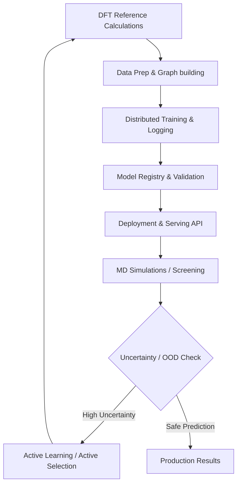

# MLOps for Machine Learning Force Fields (MLFF) at Scale on HPC

Author: Rangsiman Ketkaew

Let's do something fun and efficien. In this folder we will explor how to train an MLFF model and make it run efficiently on AWS cloud.

## What we have here
1. [MLFF lifecycle & Pipeline architecture](#1-mlff-lifecycle--pipeline-architecture)
2. [Development & Data Engineering](#2-development--data-engineering)
3. [Distributed Training at Scale (HPC & AWS)](#3-distributed-training-at-scale-hpc--aws)
4. [Model Validation & Active Learning](#4-model-validation--active-learning)
5. [High-Throughput Serving & Deployment](#5-high-throughput-serving--deployment)
6. [Production Monitoring & Drift Detection](#6-production-monitoring--drift-detection)
7. [Some Recommended Tools, Libraries & Frameworks](#7-tools-libraries--frameworks-reference)

## 1. MLFF lifecycle & Pipeline architecture

MLFF acts as a surrogate model for quantum chemistry (QC) calculations (like DFT), mapping 3D atomic coordinates ($R$) and atomic numbers ($Z$) to potential energy ($E$) and forces ($F = -\nabla_R E$), which is the energy gradient w.r.t. nuclear coordinates.

The end-to-end MLOps pipeline is cyclic and highly dependent on *Active Learning*

## 2. Development & Data Engineering

### Data formats & featurization (extracting features)

* **Input data**: Raw QC database inputs are stored in `.extxyz` (Extended XYZ) files, ASE databases (`.db`), or specialized chemical formats containing coordinates ($R$), forces ($F$), atomic numbers ($Z$), cell matrices, and potential energies ($E$).

* **Graph representation**: Atomic configurations are featurized as molecular graphs where nodes are atoms and edges are chemical bonds or distance-based neighbor connections.

* **Libraries**:
  * *ASE (Atomic Simulation Environment)*: The standard toolkit for setting up, manipulating, and analyzing structures.
  * *PyTorch Geometric (PyG)* or *DGL*: For constructing the message-passing and equivariant graphs.
  * *e3nn* / *MACE*: For constructing rotationally equivariant networks (tensor products of spherical harmonics).

### Efficient Graph Generation & Neighbor Lists

Building graph edges based on cutoffs ($r_c \approx 4.0 - 6.0 \text{ Å}$) is the most critical preprocessing step.

* *On HPC/AWS*: Use CPU-parallelized or GPU-accelerated neighbor list engines (e.g., `matscipy`, `numba`-accelerated cell lists, or `torch-neighbor-list`).

* For periodic systems (crystals, MOFs like the UMA-ODAC and UMA-OMAT presets), you must correctly wrap bonds across periodic boundary conditions (PBC).

## 3. Distributed Training at Scale (HPC & AWS)

Training large-scale MLFF models (like UMA's 1.4-billion parameter Mixture of Linear Experts model) requires distributed architectures.

### The Double-Gradient Graph Bottleneck

To compute forces, the model outputs energy $E$ and takes the gradient with respect to coordinates $R$ using Autograd

$$F = -\frac{\partial E}{\partial R}$$

This creates a **double-gradient graph** during training (autograd through autograd), which

1. doubles the GPU memory consumption.
2. increases computation time significantly.
3. requires advanced memory optimization techniques like activation checkpointing or float16/bfloat16 mixed precision.

### HPC Distributed Architecture (e.g., SLURM Clusters)

* **High-Speed Interconnect**: HPC systems use InfiniBand or Slingshot with GPUDirect RDMA.

* **Distributed Engines**: Run PyTorch `DistributedDataParallel` (DDP) or `Fully Sharded Data Parallel` (FSDP) to shard model parameters, gradients, and optimizer states across multiple nodes.

* **Launcher**: Run scripts using `torchrun` wrapped in a SLURM script allocating nodes.

### AWS Cloud Distributed Architecture

AWS provides managed elastic infrastructure for scaling up training

* **Storage**: Store training datasets (tens of millions of structures) on **Amazon FSx for Lustre** linked to an **Amazon S3** bucket. This ensures sub-millisecond latencies and high throughput for multiple parallel GPU workers.

* **Compute**: Use **AWS SageMaker** PyTorch Estimators or **Amazon EKS** (Kubernetes) with EC2 instances like `p4d.24xlarge` (8x NVIDIA A100 GPUs) or `p5.48xlarge` (8x NVIDIA H100 GPUs).

* **Network**: Leverage **Elastic Fabric Adapter (EFA)** for distributed communication matching HPC-level InfiniBand speeds.

## 4. Model Validation & Active Learning

### Evaluation Metrics

MLFF performance must satisfy both thermodynamic and kinetic criteria

* **Energy Accuracy**: Mean Absolute Error (MAE) and Root Mean Squared Error (RMSE) below chemical accuracy ($1 \text{ kcal/mol} \approx 0.043 \text{ eV/atom}$).

* **Force Accuracy**: MAE/RMSE below $0.05 \text{ eV/Å}$ or $1 \text{ kcal/mol/Å}$.

* **Physical Constraints**: Energy-force consistency (forces must exactly equal the negative gradient of energy), rotational covariance, and translational invariance.

### Active Learning Loops

MLFF models will encounter out-of-distribution (OOD) configurations during molecular dynamics (MD) simulations. So, we have to automate a robust active learning cycle.

1. **Explore**: Run MD simulations (e.g. at high temperatures, like 500 K) using the current MLFF model

2. **Query**: Compute model uncertainty (e.g., variance of forces predicted by an ensemble of models or GP prediction intervals)

3. **Verify**: If force variance exceeds a threshold (e.g., $\sigma_F > 0.15 \text{ eV/Å}$), halt the simulation and extract the structure

4. **Label**: Run a DFT calculation on the structure to compute the exact energy and forces

5. **Retrain**: Update the training dataset with the new data points and retrain the model

## 5. High-Throughput Serving & Deployment

Once trained, models must be served to downstream applications (high-throughput screening, interactive molecular visualizers, and virtual screening).

### Triton Inference Server

* Convert the PyTorch model to **TorchScript** or **ONNX** formats
* Deploy onto **Triton Inference Server** to leverage
  1. Dynamic batching (grouping individual molecular requests from parallel MD simulations).
  2. Concurrent model execution across GPU instances.
  3. Low-latency serving over gRPC.

### Serverless APIs / FastAPI
For lighter applications, deploy via **FastAPI** running on AWS ECS or AWS Lambda, exposing

* `/predict`: Expects an atomic coordinate dictionary (species and positions), returns energy and forces.

* `/optimize`: Accepts a molecular geometry, runs an internal ASE optimizer (e.g. BFGS), and returns the relaxed coordinates.

## 6. Production Monitoring & Drift Detection

Deploying MLFFs in production requires monitoring structural integrity to prevent unphysical explosions during simulations.

### Detecting Structural Drift

* *OOD Geometries*: Identify when the simulation visits a structure that is outside the model's training distribution (e.g., highly compressed bonds, weird coordination numbers).

* *Uncertainty Tracking*: Ensemble variance or Bayesian Neural Networks (BNNs).

* *Structural Descriptors*: Map configurations into descriptors like **SOAP (Smooth Overlap of Atomic Positions)** or **ACE (Atomic Cluster Expansion)** and perform real-time distance calculations against reference distributions using Kernel Density Estimation (KDE) or PCA.

### Metrics & dashboards

* Log metrics using **Prometheus**:
  * `mlff_prediction_force_uncertainty`
  * `mlff_minimum_interatomic_distance`
  * `mlff_inference_latency_ms`

* Visualize trends on a *Grafana* dashboard. Set alert thresholds for unphysically short bonds or extreme force variances to trigger safety shutdowns or automated Active Learning labeling.

## 7. Some recommended Tools, Libraries & Frameworks

| Phase | Tool/Library | Focus Area | Description |
| :--- | :--- | :--- | :--- |
| **Development** | **ASE** | Molecular structure manipulation | Standard Python interface for materials science and molecular simulations. |
| **Development** | **PyTorch Geometric (PyG)** | Graph modeling for molecules | Core graph neural network framework for constructing atomic graphs. |
| **Development** | **e3nn** | Equivariance | Tensor products of spherical harmonics for equivariant model architectures. |
| **Training** | **MLflow** | Experiment tracking | Log parameters, metrics (energy/force losses), and store model artifacts. |
| **Training** | **PyTorch FSDP** | Distributed scaling | Sharding parameters across multiple nodes (necessary for large models). |
| **Serving** | **NVIDIA Triton Inference Server** | High throughput | Serve TorchScript/ONNX models with dynamic batching and low-latency gRPC. |
| **Serving** | **FastAPI** | REST API | Easy-to-use microservice interface to run ASE structural relaxations. |
| **Monitoring** | **DScribe** | Feature extraction | Fast computation of descriptors like SOAP, ACSF, etc. for drift detection. |
| **Monitoring** | **Prometheus + Grafana** | Observability | Real-time monitoring of inference statistics, latencies, and data drift. |

Note that Torch Serve is not maintained anymore, try NVIDIA Triton Inference Server instead.
