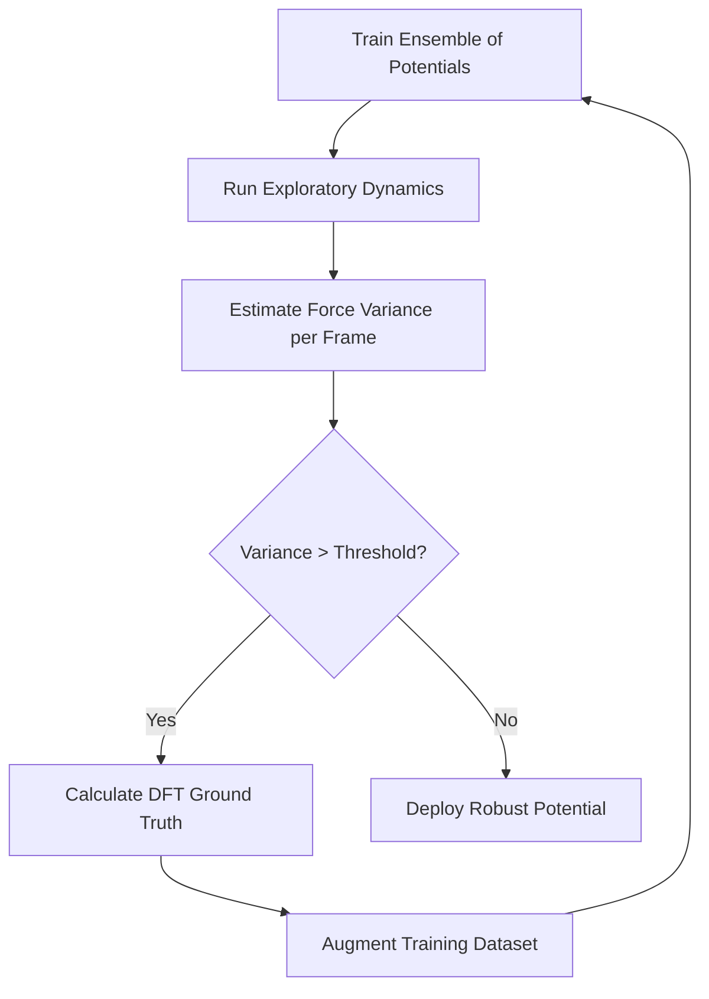

# MLIP Active Learning Loops

Use this skill when attempting to train highly robust Machine Learning Interatomic Potentials (MLIP) with minimal DFT data. Active Learning (AL) automatically guides data collection to regions where the potential is most uncertain (e.g. bond-breaking conformations, transition states).

## Conceptual Framework

### Active Learning Loop Workflow
1. **Initial Seed Dataset:** Train an initial ensemble of potentials on a small set of relaxed structures.
2. **Exploration (MD):** Run molecular dynamics simulations (or conformational search) using the current ensemble.
3. **Uncertainty Quantification (UQ):** Compute force predictions from all ensemble members for each trajectory snapshot. Calculate the variance of forces across the ensemble:
   $$\sigma_F^2(R) = \frac{1}{M} \sum_{m=1}^{M} \|F_m(R) - \bar{F}(R)\|^2$$
4. **Configuration Selection (Query Strategy):** Select frames where the force variance $\sigma_F^2$ exceeds a pre-defined threshold $\theta_{\text{query}}$, representing configurations that are out-of-distribution (OOD) for the current models.
5. **Oracle Calculation (DFT):** Run high-level quantum mechanical calculations on the selected frames to obtain ground-truth energies and forces.
6. **Retraining:** Add the newly calculated structures to the dataset and retrain the models.



## Running the Simulation

Run the active learning loop script to see how the model error decreases over multiple query iterations:
```bash
python scripts/active_learning_loop.py --al_iterations 3 --query_threshold 0.5
```
