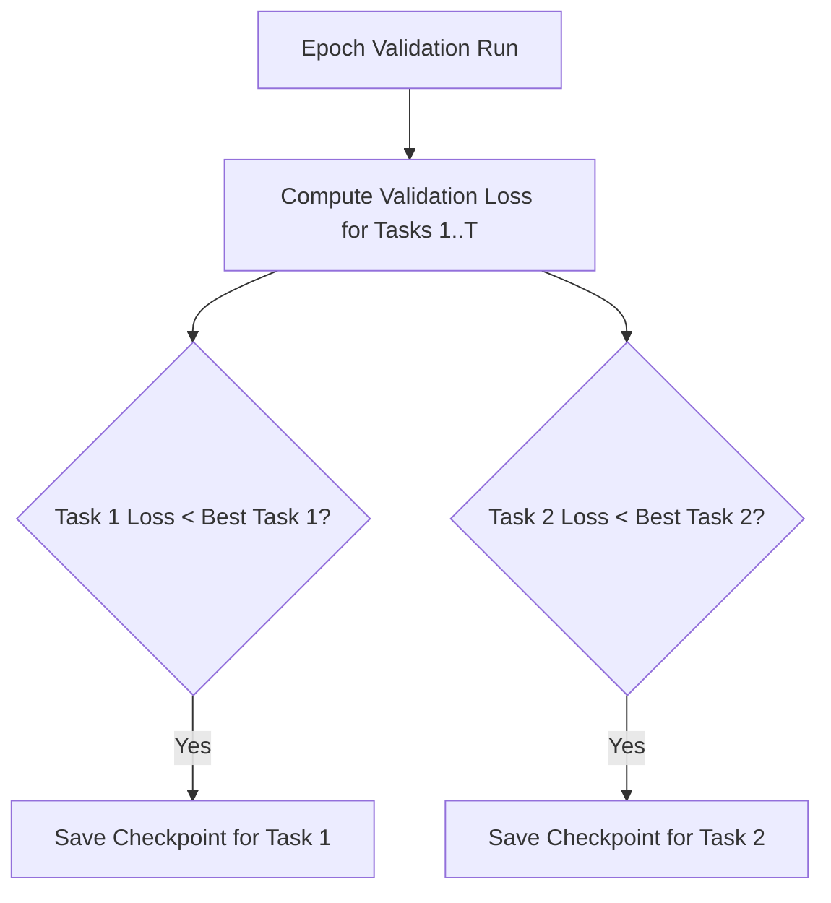

# Multi-Task Learning with Adaptive Checkpointing (ACS)

Use this skill when training machine learning models on multiple property prediction tasks simultaneously, particularly when labels are sparse, imbalanced, or when tasks exhibit negative transfer.

## Conceptual Framework

### The Problem of Negative Transfer (NT)
In Multi-Task Learning (MTL), a shared encoder (e.g., GNN backbone) is optimized based on the average gradients of multiple tasks. When tasks are contradictory, updates for Task A can destroy performance on Task B, a phenomenon known as **Negative Transfer**. This is amplified in low-data regimes or with imbalanced labels.

### Adaptive Checkpointing with Specialization (ACS)
ACS addresses Negative Transfer without changing model architecture:
1. **Shared Encoder + Task Heads:** The model has a shared backbone and individual prediction heads.
2. **Independent Checkpoints:** Instead of saving a single "best overall" model, ACS monitors the validation performance of each task independently.
3. **Task-Specific Specialization:** Whenever Task $k$ reaches a new validation minimum, the current state of both the shared backbone and task $k$'s head are checkpointed.
4. **Optimal Inference:** During inference, we load the specialized weights corresponding to the target task.



## Running the Training Script

Execute `train_multitask_acs.py` to simulate ACS training:
```bash
python scripts/train_multitask_acs.py --num_tasks 3 --epochs 20
```
This script builds a multi-task network and demonstrates how task-specific checkpoints are captured and saved.
